<div align=center>

# Laporan Resmi Modul 4 Jaringan Komputer

</div>

## Anggota Kelompok IT05

|Nama|NRP|
|--|--|
|Fazrul Ahmad Fadhillah|5027221025|
|Awang Fraditya|5027221055|

## TOPOLOGI GNS
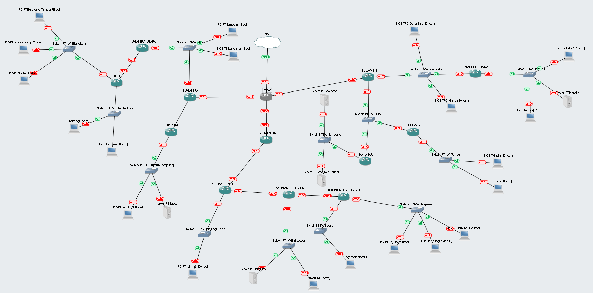

## TOPOLOGI CPT


## RUTE
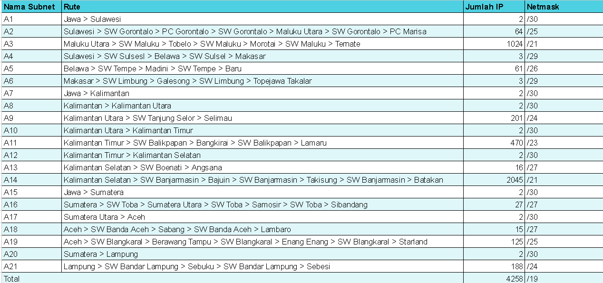
Di atas adalah hasil dari perhitungan subnet dan rute berdasarkan topologi yang sudah dibuat


# VLSM
VLSM (Variable Length Subnet Mask) adalah metode subnetting di jaringan komputer yang membagi jaringan IP menjadi subnet dengan ukuran yang berbeda-beda. Keuntungan menggunakan VLSM:

- Penggunaan alamat IP yang lebih efisien: VLSM memungkinkan kita untuk mengalokasikan alamat IP hanya untuk host yang membutuhkannya, sehingga meminimalkan pemborosan alamat IP.
- Meningkatkan fleksibilitas: VLSM memungkinkan kita untuk membuat subnet dengan berbagai ukuran, yang dapat disesuaikan dengan kebutuhan jaringan kita.
- Mempermudah pengelolaan jaringan: VLSM memudahkan kita untuk mengelola jaringan yang kompleks dengan membagi jaringan menjadi subnet yang lebih kecil dan lebih mudah dikelola.
## TREE

Di atas adalah hasil Tree dalam menggunakan metode VLSM.

## Pembagian IP

Setelah membuat tree, selanjutnya kita membuat pembagian ip untuk subnet yang sudah dipecah, di atas adalah pembagian ip yang digunakan oleh kelompok kami.

## Config
- JAWA
```sh
auto lo
iface lo inet loopback

auto eth0
iface eth0 inet dhcp

#A15
auto eth1
iface eth1 inet static
address 10.66.6.61
netmask 255.255.255.252

#A7
auto eth2
iface eth2 inet static
address 10.66.6.77
netmask 255.255.255.252

#A1
auto eth3
iface eth3 inet static
address 10.66.6.73
netmask 255.255.255.252
```

- SUMATERA
```sh
auto lo
iface lo inet loopback

#A15
auto eth0
iface eth0 inet static
address 10.66.6.62 
netmask 255.255.255.252
gateway 10.66.6.61

#A16
auto eth1
iface eth1 inet static
address 10.66.6.161
netmask 255.255.255.224

#A20
auto eth2
iface eth2 inet static
address 10.66.6.53
netmask 255.255.255.252
```

- LAMPUNG
```sh
auto lo
iface lo inet loopback

#A20
auto eth0
iface eth0 inet static
address 10.66.6.54
netmask 255.255.255.252
gateway 10.66.6.53

#A21
auto eth1
iface eth1 inet static
address 10.66.13.1
netmask 255.255.255.0
```

- SEBUKU (186 host)
```sh
#A21
auto eth0
iface eth0 inet static
address 10.66.13.6
netmask 255.255.255.0
gateway 10.66.13.1 
```

- SEBESI
```sh
#A21
auto eth0
iface eth0 inet static
address 10.66.13.11
netmask 255.255.255.0
gateway 10.66.13.1 
```

- SAMOSIR (14 host)
```sh
#A16
auto eth0
iface eth0 inet static
address 10.66.6.166
netmask 255.255.255.224
gateway 10.66.6.161
```

- SIBANDANG (11 host)
```sh
#A16
auto eth0
iface eth0 inet static
address 10.66.6.171
netmask 255.255.255.224
gateway 10.66.6.161
```

- SUMATERA UTARA
```sh
auto lo
iface lo inet loopback

#A16
auto eth0
iface eth0 inet static
address 10.66.6.162
netmask 255.255.255.224
gateway 10.66.6.161

#A17
auto eth1
iface eth1 inet static
address 10.66.6.49
netmask 255.255.255.252
```

- ACEH
```sh
auto lo
iface lo inet loopback

#A17
auto eth0
iface eth0 inet static
address 10.66.6.50 
netmask 255.255.255.252
gateway 10.66.6.49

#A19
auto eth1
iface eth1 inet static
address 10.66.7.129
netmask 255.255.255.128

#A18
auto eth2
iface eth2 inet static
address 10.66.6.97
netmask 255.255.255.224
```

- SABANG (6 host)
```sh
#A18
auto eth0
iface eth0 inet static
address 10.66.6.102
netmask 255.255.255.224
gateway 10.66.6.97 
```

- LAMBARO (8 host)
```sh
#A18
auto eth0
iface eth0 inet static
address 10.66.6.107
netmask 255.255.255.224
gateway 10.66.6.97 
```

- BERAWANG TAMPU (53 host)
```sh
#A19
auto eth0
iface eth0 inet static
address 10.66.7.135
netmask 255.255.255.128
gateway 10.66.7.129
```

- ENANG-ENANG (27 host)
```sh
#A19
auto eth0
iface eth0 inet static
address 10.66.7.140
netmask 255.255.255.128
gateway 10.66.7.129 
```

- STARLAND (44 host)
```sh
#A19
auto eth0
iface eth0 inet static
address 10.66.7.145
netmask 255.255.255.128
gateway 10.66.7.129 
```

- SULAWESI
```sh
auto lo
iface lo inet loopback

#A1
auto eth0
iface eth0 inet static
address 10.66.6.74 
netmask 255.255.255.252
gateway 10.66.6.73

#A4
auto eth1
iface eth1 inet static
address 10.66.6.81
netmask 255.255.255.248

#A2
auto eth2
iface eth2 inet static
address 10.66.7.1
netmask 255.255.255.128
```

- PC GORONTALO (32 host)
```sh
#A2
auto eth0
iface eth0 inet static
address 10.66.7.11
netmask 255.255.255.128
gateway 10.66.7.1
```

- PC MARISA (30 host)
```sh
#A2
auto eth0
iface eth0 inet static
address 10.66.7.16
netmask 255.255.255.128
gateway 10.66.7.1
```

- KALIMANTAN
```sh
auto lo
iface lo inet loopback

#A7
auto eth0
iface eth0 inet static
address 10.66.6.78
netmask 255.255.255.252
gateway 10.66.6.77

#A8
auto eth1
iface eth1 inet static
address 10.66.6.65
netmask 255.255.255.252
```

- KALIMANTAN UTARA
```sh
auto lo
iface lo inet loopback

#A8
auto eth0
iface eth0 inet static
address 10.66.6.66 
netmask 255.255.255.252
gateway 10.66.6.65

#A9
auto eth1
iface eth1 inet static
address 10.66.12.1
netmask 255.255.255.0

#A10
auto eth2
iface eth2 inet static
address 10.66.6.69
netmask 255.255.255.252
```

- SELIMAU (200 host)
```sh
#A9
auto eth0
iface eth0 inet static
address 10.66.12.5
netmask 255.255.255.0
gateway 10.66.12.1 
```

- KALIMANTAN TIMUR
```sh
auto lo
iface lo inet loopback

#A10
auto eth0
iface eth0 inet static
address 10.66.6.70 
netmask 255.255.255.252
gateway 10.66.6.69

#A11
auto eth1
iface eth1 inet static
address 10.66.14.1
netmask 255.255.254.0

#A12
auto eth2
iface eth2 inet static
address 10.66.6.57 
netmask 255.255.255.252
```

- BANGKIRAI
```sh
#A11
auto eth0
iface eth0 inet static
address 10.66.14.5
netmask 255.255.254.0
gateway 10.66.14.1  
```

- LAMARU (468 host)
```sh
#A11
auto eth0
iface eth0 inet static
address 10.66.14.10
netmask 255.255.254.0
gateway 10.66.14.1  
```

- KALIMANTAN SELATAN 
```sh
auto lo
iface lo inet loopback

#A12
auto eth0
iface eth0 inet static
address 10.66.6.58 
netmask 255.255.255.252
gateway 10.66.6.57

#A13
auto eth1
iface eth1 inet static
address 10.66.6.129 
netmask 255.255.255.224

#A14
auto eth2
iface eth2 inet static
address 10.66.16.1 
netmask 255.255.248.0
```

- ANGSANA (15 host)
```sh
#A13
auto eth0
iface eth0 inet static
address 10.66.6.134
netmask 255.255.255.224
gateway 10.66.6.129   
```

- BAJUIN (511 host)
```sh
#A14
auto eth0
iface eth0 inet static
address 10.66.16.15
netmask 255.255.248.0
gateway 10.66.16.1
```

- TAKISUNG (513 host)
```sh
#A14
auto eth0
iface eth0 inet static
address 10.66.16.20
netmask 255.255.248.0
gateway 10.66.16.1
```

- BATAKAN (1020 host)
```sh
#A14
auto eth0
iface eth0 inet static
address 10.66.16.25
netmask 255.255.248.0
gateway 10.66.16.1
```


- MAKASAR
```sh
auto lo
iface lo inet loopback

#A4
auto eth0
iface eth0 inet static
address 10.66.6.82
netmask 255.255.255.248
gateway 10.66.6.81 

#A6
auto eth1
iface eth1 inet static
address 10.66.6.89
netmask 255.255.255.248
```

- GALESONG
```sh
#A6
auto eth0
iface eth0 inet static
address 10.66.6.90
netmask 255.255.255.248
gateway 10.66.6.89
```

- TOPEJAWA TAKALAR
```sh
#A6
auto eth0
iface eth0 inet static
address 10.66.6.91
netmask 255.255.255.248
gateway 10.66.6.89
```


- BELAWA
```sh
auto lo
iface lo inet loopback

#A4
auto eth0
iface eth0 inet static
address 10.66.6.83
netmask 255.255.255.248
gateway 10.66.6.81 

#A5
auto eth1
iface eth1 inet static
address 10.66.6.193 
netmask 255.255.255.192
```

- MADINI (30 host)
```sh
#A5
auto eth0
iface eth0 inet static
address 10.66.6.203
netmask 255.255.255.192
gateway 10.66.6.193
```

- BARU (30 host)
```sh
#A5
auto eth0
iface eth0 inet static
address 10.66.6.198
netmask 255.255.255.192
gateway 10.66.6.193
```


- MALUKU UTARA
```sh
auto lo
iface lo inet loopback

#A2
auto eth0
iface eth0 inet static
address 10.66.7.2
netmask 255.255.255.128
gateway 10.66.7.1  

#A3
auto eth1
iface eth1 inet static
address 10.66.24.1 
netmask 255.255.248.0
```

- TOBELO (511 host)
```sh
#A3
auto eth0
iface eth0 inet static
address 10.66.24.20
netmask 255.255.248.0
gateway 10.66.24.1
```

- MOROTAI
```sh
#A3
auto eth0
iface eth0 inet static
address 10.66.25.1
netmask 255.255.248.0
gateway 10.66.24.1
```

- TERNATE (511 host)
```sh
#A3
auto eth0
iface eth0 inet static
address 10.66.24.15
netmask 255.255.248.0
gateway 10.66.24.1
```
# CIDR

## Penggabungan Topologi

**Level 0**
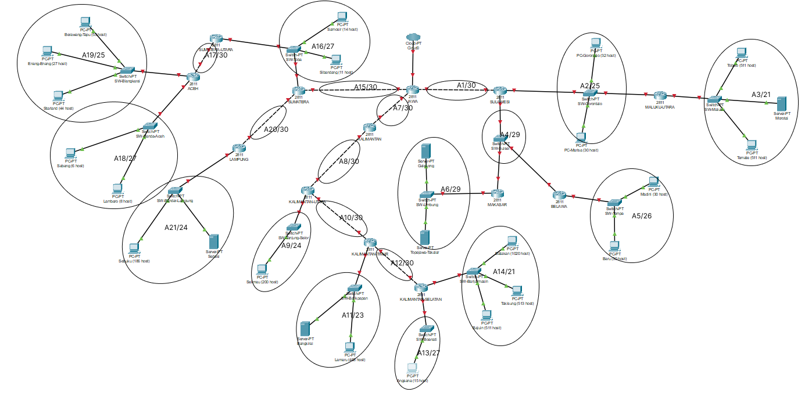


**Level 1**
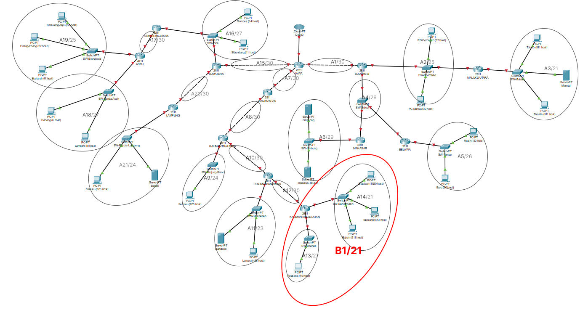
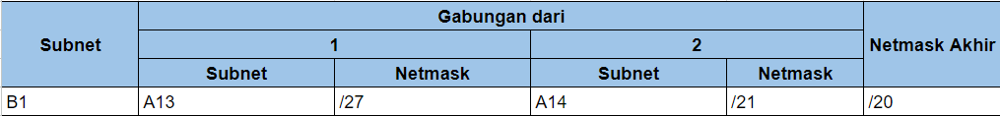

**Level 2**
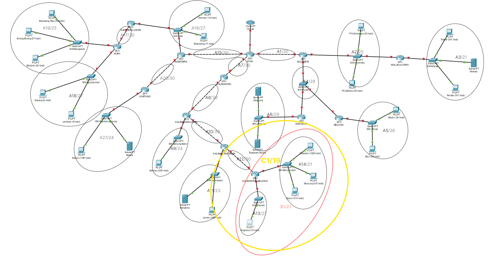
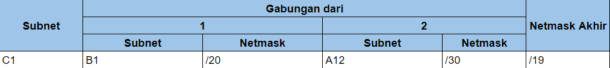

**Level 3**
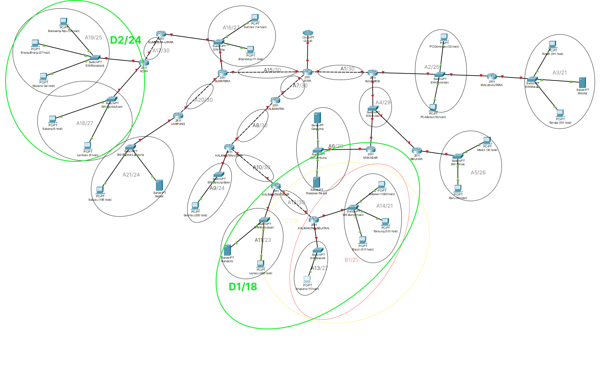
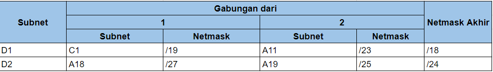

**Level 4**
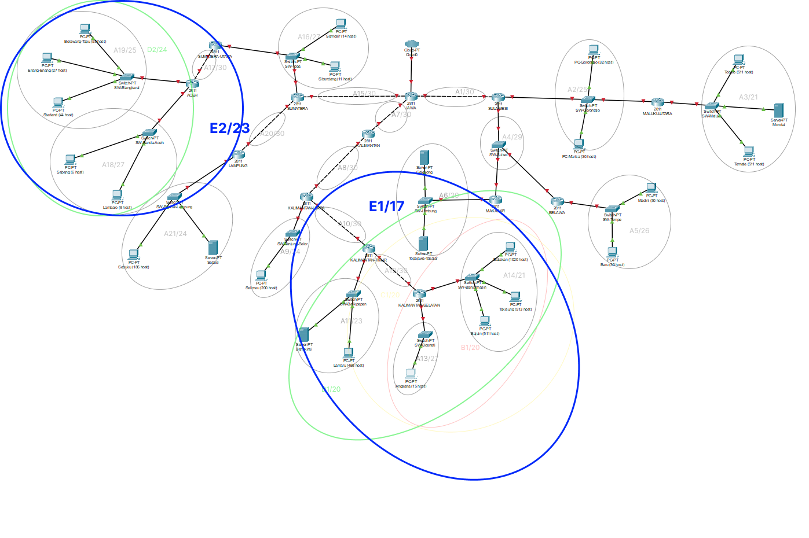
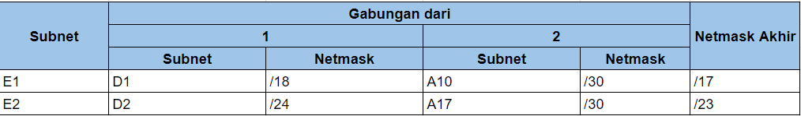

**Level 5**
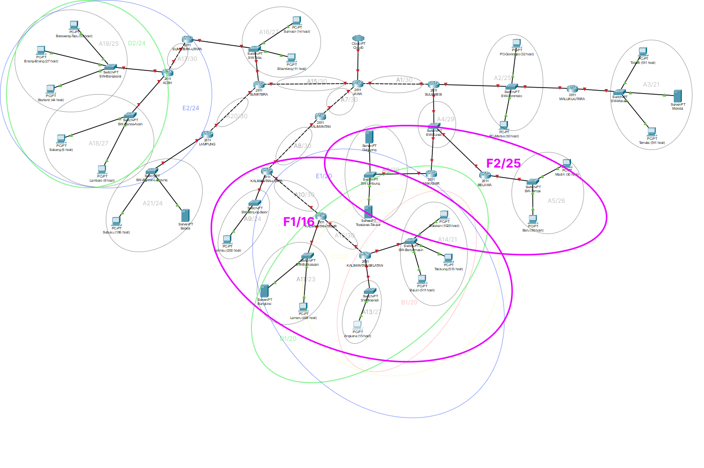
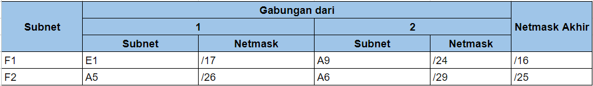

**Level 6**
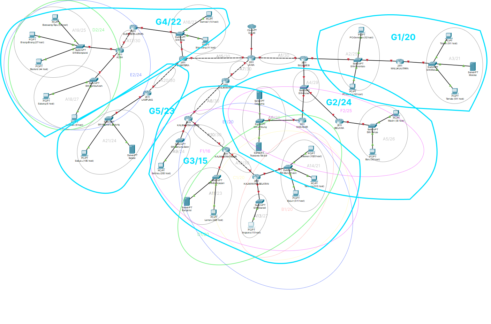
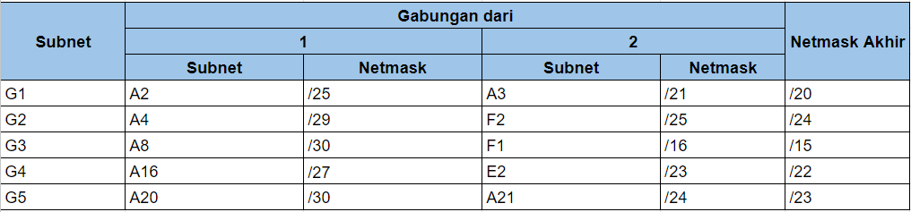

**Level 7**
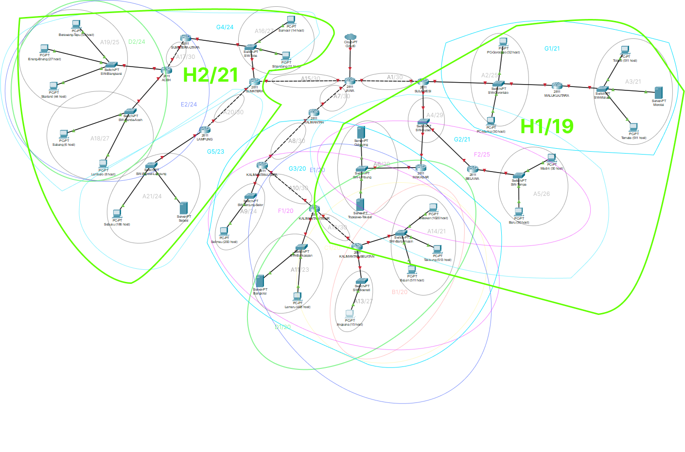
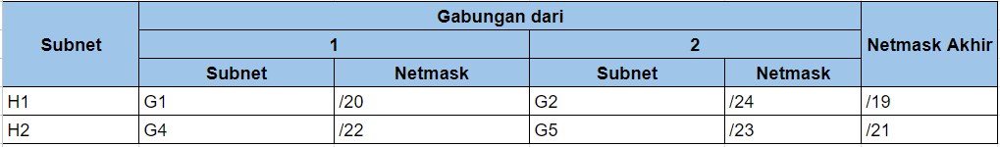

**Level 8**
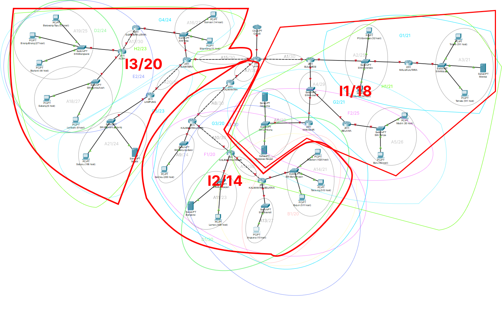
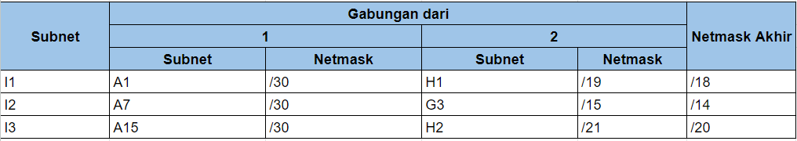

**Level 9**
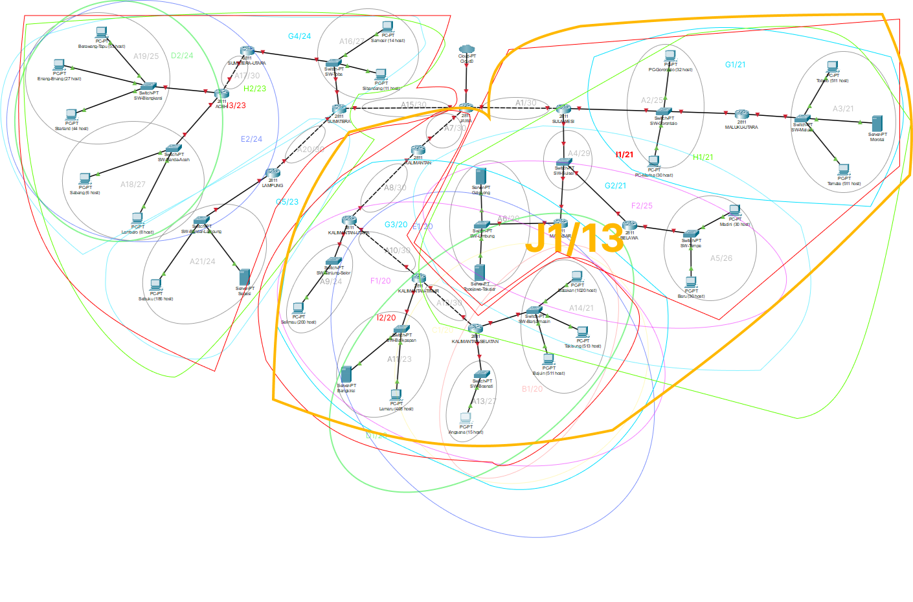
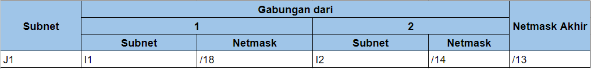

**Level 10**

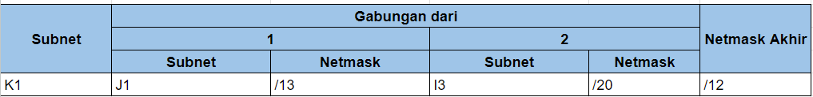

## Tree CIDR

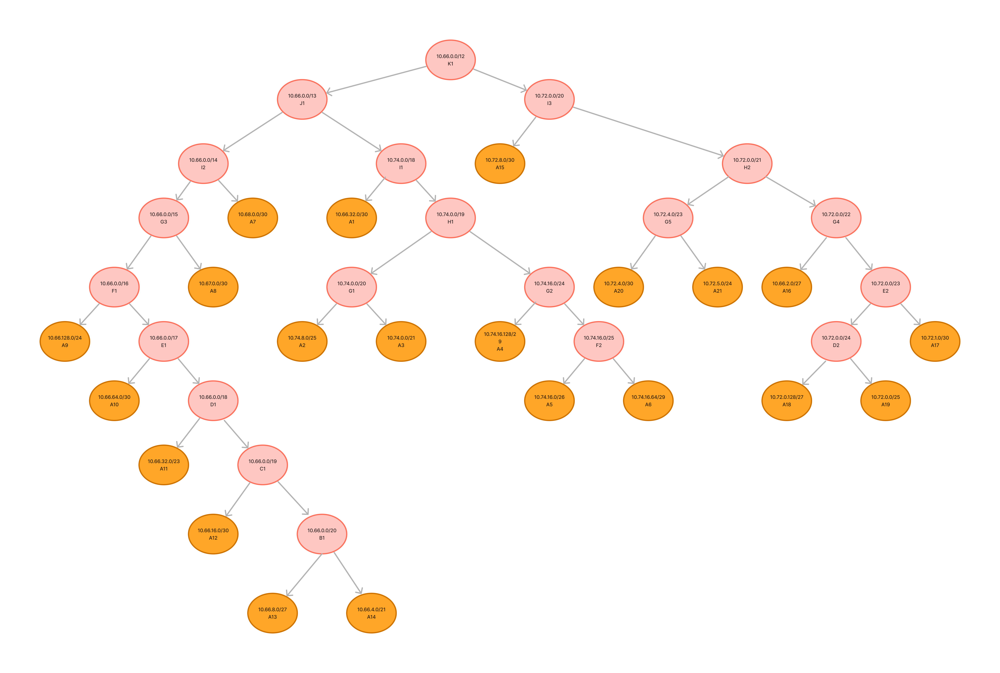

## Pembagian IP

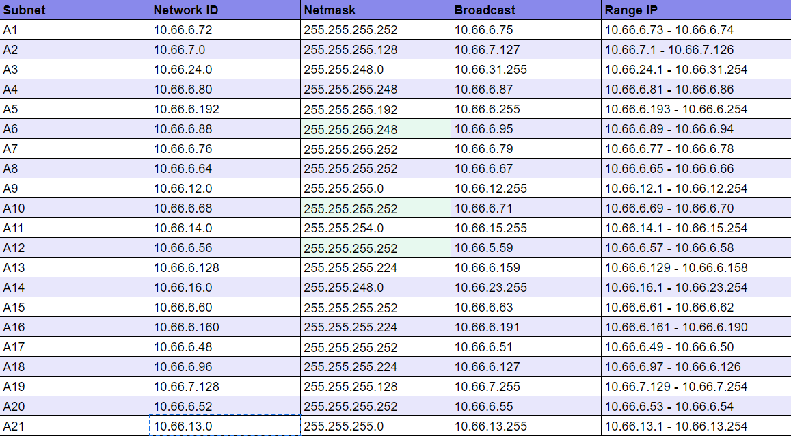

