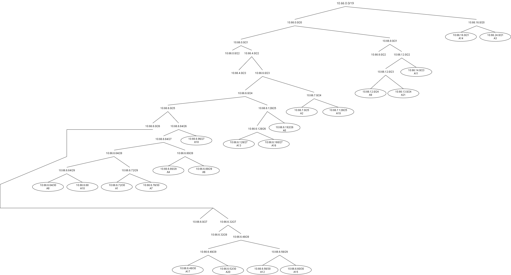
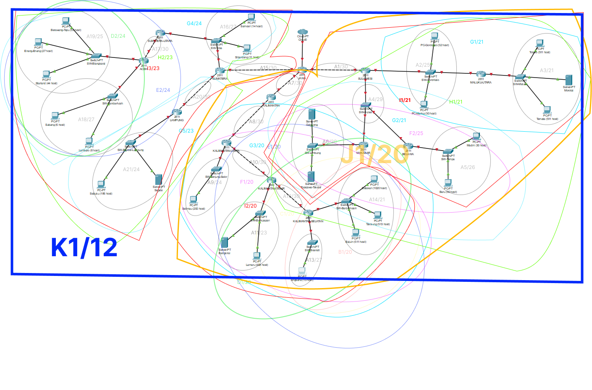

# Laporan Resmi Modul 4 Jaringan Komputer

## Anggota Kelompok IT05

|Nama|NRP|
|--|--|
|Fazrul Ahmad Fadhillah|5027221025|
|Awang Fraditya|5027221055|

## TOPOLOGI GNS

## TOPOLOGI CPT

## RUTE

Di atas adalah hasil dari perhitungan subnet dan rute berdasarkan topologi yang sudah dibuat

# VLSM
VLSM (Variable Length Subnet Mask) adalah metode subnetting di jaringan komputer yang membagi jaringan IP menjadi subnet dengan ukuran yang berbeda-beda. Keuntungan menggunakan VLSM:

- Penggunaan alamat IP yang lebih efisien: VLSM memungkinkan kita untuk mengalokasikan alamat IP hanya untuk host yang membutuhkannya, sehingga meminimalkan pemborosan alamat IP.
- Meningkatkan fleksibilitas: VLSM memungkinkan kita untuk membuat subnet dengan berbagai ukuran, yang dapat disesuaikan dengan kebutuhan jaringan kita.
- Mempermudah pengelolaan jaringan: VLSM memudahkan kita untuk mengelola jaringan yang kompleks dengan membagi jaringan menjadi subnet yang lebih kecil dan lebih mudah dikelola.
## TREE

Di atas adalah hasil Tree dalam menggunakan metode VLSM.

## Pembagian IP

# CIDR

## Penggabungan Topologi

**Level 0**

**Level 1**

**Level 2**

**Level 3**

**Level 4**

**Level 5**

**Level 6**

**Level 7**

**Level 8**

**Level 9**

**Level 10**

## Tree CIDR

## Pembagian IP

